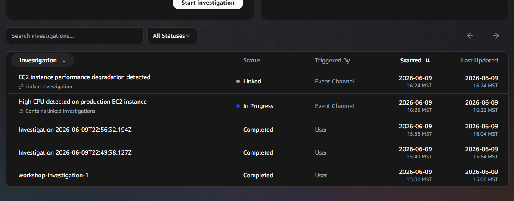

# Incident Triage

## Observe incident correlation

When multiple incidents arrive close together, the agent's **triage phase** automatically determines whether they're related. Related incidents are **linked** to a single investigation to avoid duplicate work.

### Step 1: Trigger a second webhook incident

Run this shortly after Module 7. The agent uses a ~20-minute look-back window for correlation — if too much time passes, it won't link the incidents.

From your Session Manager terminal, send another webhook with a slightly different description:

```
TIMESTAMP=$(date -u +%Y-%m-%dT%H:%M:%S.000Z)
INCIDENT_ID="webhook-correlated-$(date +%s)"

PAYLOAD=$(cat <<EOF
{
  "eventType": "incident",
  "incidentId": "$INCIDENT_ID",
  "action": "created",
  "priority": "HIGH",
  "title": "EC2 instance performance degradation detected",
  "description": "Application response times have increased significantly. Suspected resource constraint on EC2 instance in the same region.",
  "service": "EC2-Workshop-Test",
  "timestamp": "$TIMESTAMP",
  "data": {
    "metadata": {
      "region": "$(curl -s http://169.254.169.254/latest/meta-data/placement/region)",
      "environment": "workshop"
    }
  }
}
EOF
)

SIGNATURE=$(echo -n "${TIMESTAMP}:${PAYLOAD}" | openssl dgst -sha256 -hmac "$SECRET" -binary | base64)

curl -X POST "$WEBHOOK_URL" \
  -H "Content-Type: application/json" \
  -H "x-amzn-event-timestamp: $TIMESTAMP" \
  -H "x-amzn-event-signature: $SIGNATURE" \
  -d "$PAYLOAD"
```

### Step 2: Observe triage behavior

Go to **Incidents** in the web app. You may see one of two outcomes:

**Linked** — The agent determined this incident is related to the previous webhook investigation and linked them together. You'll see:

- Status: **LINKED**
- Correlation reasoning explaining why
- The primary investigation shows linked incidents

**Proceed** — The agent determined this is a separate issue and started a new investigation.



### How triage works

The agent uses a ~20-minute look-back window and analyzes:

- **Component similarities** — same service, same resources
- **Geographic region** — same account and region
- **Timing patterns** — incidents arriving close together

### Unlinking incidents

If the agent incorrectly correlates incidents:

1. Open the primary investigation
2. Find the linked incident
3. Click **Unlink** — this reschedules it as an independent investigation

You can also create a **Skill** with custom correlation rules and target it to the **Incident Triage** agent type. This teaches the agent your organization's specific correlation logic.
