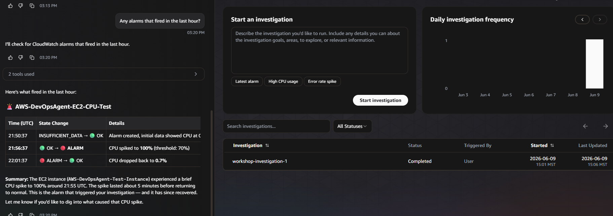

# Chat & Artifacts

## Query your infrastructure with Chat

Chat is a natural language interface integrated throughout the web app. It's context-aware — responses change based on which page you're viewing.

### Resource queries

1. Click the **+** button on the left-hand side to open a new Chat window.
2. Try these prompts:

```
Show me the EC2 instances and their current status.
```

```
What resources would be affected if my EC2 test instance went down?
```

### System health analysis

```
Any alarms that fired in the last hour?
```

```
What's the CPU utilization trend for my EC2 instance over the last 30 minutes?
```



### Generate an Artifact

Artifacts are structured, versioned documents the agent generates during a conversation.

Artifact generation may take 1-2 minutes — the agent is gathering data and formatting a full report.

Try this prompt in the chat:

```
Create a brief incident report for the CPU alarm that fired today.
```

This will take a few minutes to generate.


The artifact appears in a dedicated panel alongside the conversation. You can:

- **Review** the full content
- **Edit** by asking Chat to modify it (e.g., "Add a section about alarm history")
- Each edit creates a new **version**

If the artifact doesn't appear in a dedicated panel, you can open it from the navigation bar on the left — click **Artifacts**, then select the artifact created.

### Context awareness

Chat adapts based on where you are in the console:

| Page | Chat context |
| --- | --- |
| **Topology** | Full visibility into all resources, metrics, architecture |
| **Incidents** | Investigation trends, resolution times, patterns |
| **Investigation Detail** | That specific investigation's logs, hypotheses, RCA |
| **Prevention** | Recommendation filtering and impact analysis |

### Chat vs Investigations

| Aspect | Chat | Investigation |
| --- | --- | --- |
| Who drives | You ask, agent answers | Agent runs autonomously |
| Speed | Quick, real-time | Minutes, multi-step |
| Use case | Ad-hoc queries, reports | Full incident response |
| Triggers Prevention | No | Yes |
